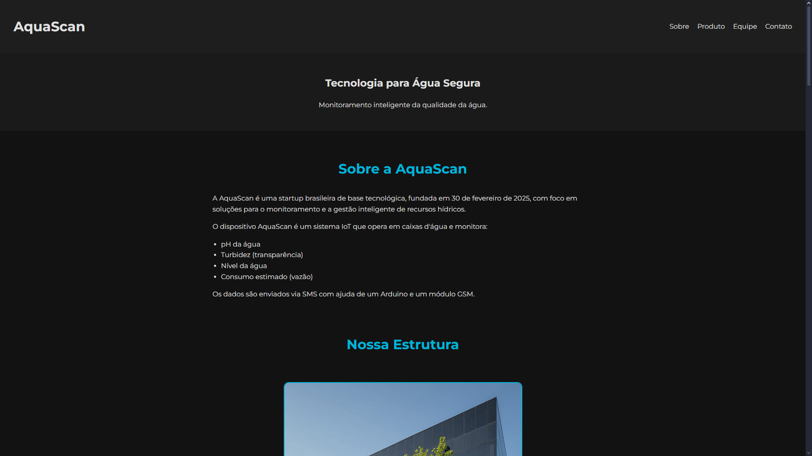

# 💧 AquaScan - Smart Water Monitoring Solutions

Welcome to the **AquaScan** project repository, an institutional website for a fictional company focused on innovative solutions for water quality and level monitoring. This project was developed as part of the requirements for the [**Analysis and Systems Development**] at [**UNINOVE**].

---

### ✨ Project Overview

**AquaScan** was founded on February 30, 2025, and aims to offer a cutting-edge product that monitors water level and impurity presence in real-time, providing crucial data for water management, whether for residential, industrial, or environmental use. The AquaScan device is an IoT system that operates in water tanks and monitors:

* **Water pH**
* **Turbidity (transparency)**
* **Water level**
* **Estimated consumption (flow)**

Data is sent via SMS with the help of an Arduino and a GSM module.

The website serves as a portal to introduce the company, detail the product, its functionalities, and technologies, as well as provide contact channels for potential clients and partners. This project represents the application of web development concepts, interface design, and group project management, aiming to simulate a real-world work environment for creating a complete digital solution.

---

### 🚀 Key Website Features

* **Homepage:** Introduction to AquaScan, value proposition, and product highlight.
* **About Us:** Information about the company, mission, vision, and values.
* **Our Product (AquaSensor):** Technical details and benefits of the monitoring device.
* **How It Works:** Explanation of the sensor and data platform's operation.
* **Contact:** Contact form for inquiries, quotes, and support.
* **Responsive Design:** The website is optimized for viewing on various devices (desktops, tablets, and smartphones).

---

### 💻 Technologies Used

The following technologies were employed in the development of this project:

* **HTML5:** For the semantic structuring of page content.
* **CSS3:** For styling, layout, and responsiveness of the website.
* **JavaScript:** For interactivity, form validation, and visual effects.
* **Git & GitHub:** For version control and team collaboration.

---

### 📸 Website Screenshot

---

### 🔗 Live Project Link (Live Demo)

You can explore the AquaScan website in production, hosted via GitHub Pages, at the following link:
[https://pedropollis.github.io/AquaScan/](https://pedropollis.github.io/AquaScan/)

---

### 📝 Remember 

This project is open-source. Feel free to use and modify it for study or learning purposes.
